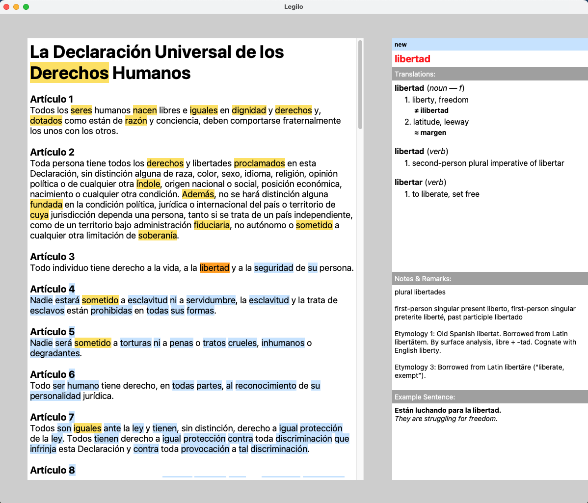

# Legilo
Legilo is a reading tool that facilitates language practicing by allowing you to read any text in the language you are learning and making it easy to identify and look up words and expressions that you don't know yet. The UI is illustrated below:

# How does it work?
The application allows you to import any text you want in your target language. The program labels all words in the text to one of the following categories: new, learning, known or ignored. The new words are marked with a blue background, the learning words are marked with a yellow background, and the known or ignored words are unmarked.

New words are words that haven't been seen previously in any text. Learning words are words that you have seen in some text before, and looked up, but that you don't consider that you know yet. Known words are words that you have skipped without looking up or that you have marked explicitly as known. Ignored words are words that you consider irrelevant, e.g. names, words in another language or numbers. This category is similar to known words, but the words will be stored in a separate list, without translations, and will not be counted into the sum of your known words (that is shown when closing the program).

When reading a text, you iterate through the new and learning words using the keyboard (see below). The current word is marked with an orange background. You can look up a marked word easily or change the label of it using the keyboard as well.

# How to use it?
## Disclaimer
The program has only been tested for macOS, and it is unclear if it will work on other operating systems without further modifications. The code is unfortunately not very well organized (I was a beginner in Python programming when starting this project), and there are probably many unfound bugs left. I made the program for my personal use, and there are no guarantees that it will work well for anyone else. However, you are very welcome to try it out on your own risk.

## Get started
Start by downloading the files, e.g. using `git clone` or clicking the green button "Code" at the top of this page, choosing "Download ZIP" and unzipping the downloaded files. Then navigate to the folder in the terminal (type `cd <path to the folder with the files>`). After that, you type `./run.sh` and press <kbd>⏎ Enter</kbd>. This will activate a Python virtual environment (it is created if it doesn't exist already), and make sure that all necessary dependencies are installed in this virtual environment. After that, the program UI will open up in a window.

## Language and text selection
Choose language by pressing the indicated key (the letter within `[]`) for each language name. Choose whether you want to add a new text or open a previous text by pressing <kbd>n</kbd> or <kbd>o</kbd>. Press <kbd>⏎ Enter</kbd> to confirm your choices. In this start window, you can also choose to activate dark mode by pressing <kbd>d</kbd> and to deactivate pronunciation by pressing <kbd>p</kbd>. Deactivating pronunciation might make lookup of words faster.

## New text
- Alt. 1 (Manual text insertion): Paste a title for the text in the first text field and the rest of the text in the second text field. Press <kbd>⏎ Enter</kbd> to deactivate the text field, and press <kbd>⏎ Enter</kbd> again to confirm.
- Alt. 2 (Automatic text fetching): Paste an URL in the title field and press <kbd>⏎ Enter</kbd>. If the site could be fetched, the text will appear in the text fields. Edit it as you want and then press <kbd>⏎ Enter</kbd> to deactivate the text field, and press <kbd>⏎ Enter</kbd> again to confirm.

## Old text
Select one of the listed previously opened texts by pressing the number before it, or type the name of a text file in the folder `data/<language>/texts` in the text field and press <kbd>⏎ Enter</kbd>.

## Basic navigation
- <kbd>→</kbd> / <kbd>Space</kbd>: Mark the next new or learning word. If the currently marked word is new, and hasn't been looked up, it is marked as known when going to the next word. If it has been looked up, it is saved as a learning word (to prevent this, you can explicitly mark it as known by pressing <kbd>↓</kbd>).
- <kbd>↑</kbd> / <kbd>⏎ Enter</kbd>:
    - If the dictionary is closed: Look up the marked word in the dictionary.
    - If the dictionary is open: Save the translation for the looked up word and mark it as a learning word.
- <kbd>↓</kbd>: Label the marked word as known.
- <kbd>⌫ Backspace</kbd>: Label the marked word as ignored.
- <kbd>←</kbd>: Go back to the previous learning word.
- Click on a word to skip to it directly (all new words before it will be automatically labeled as known).
- <kbd>i</kbd>: Insert (or edit) your own translation for a looked-up word. Press <kbd>⏎ Enter</kbd> / <kbd>↑</kbd> to save it. If the input is empty, the personal translation is removed.
- <kbd>o</kbd>: Add (or remove) a Google translation for a looked-up word.
- <kbd>p</kbd>: Pronounce the maked word.
- <kbd>h</kbd>: Add a translation of a looked-up word, and its translations in English, to your third language (set in `config.json`) in the remark section.
- <kbd>r</kbd>: Edit the remark for a looked-up word. Press <kbd>⏎ Enter</kbd> to save.
- <kbd>1</kbd>-<kbd>7</kbd>: Select and show different example sentences for the looked-up word. Press <kbd>0</kbd> to not show any example sentence at all. Press <kbd>8</kbd> to use the current sentence in the text and its Google translation as example sentence. Press <kbd>9</kbd> to use the current sentence without translation.
- <kbd>⌘ Command</kbd> + <kbd>↓</kbd> / <kbd>⌘ Command</kbd> + <kbd>↑</kbd>: Scroll the text.
- <kbd>⇧ Shift</kbd> + <kbd>↓</kbd> / <kbd>⇧ Shift</kbd> + <kbd>↑</kbd>: Scroll the translation.
- <kbd>⌥ Option</kbd> + <kbd>↓</kbd> / <kbd>⌥ Option</kbd> + <kbd>↑</kbd>: Scroll the remark.

## Phrase mode
Phrase mode allows you to look up and save translations for phrases consisting of several words. A saved phrase will show up underlined in any future occurrence, and you can see the translation again by selecting it in phrase mode.
- Press <kbd>e</kbd> to activate or deactivate phrase mode. When phrase mode is active, the word marker will change colors from orange to green, and the mouse pointer will change to a dot.
- Translate a new phrase:
    - Alt. 1 (using the mouse): In phrase mode, click the first and last word in the phrase you want to look up. After this, phrase mode will be deactivated and a Google translation will be shown.
    - Alt. 2 (using the keyboard): In phrase mode, use <kbd>→</kbd> / <kbd>←</kbd> to navigate to the first word in the phrase, and press <kbd>⏎ Enter</kbd> / <kbd>↑</kbd> to select it. Repeat the same procedure to select the second word in the phrase. After this, phrase mode will be deactivated and a Google translation will be shown.
- See translation for a previously saved phrase:
    - Alt. 1 (using the mouse): In phrase mode, click any word in the underlined phrase. Phrase mode will be deactivated and the saved translation for the phrase will be shown.
    - Alt. 2 (using the keyboard): In phrase mode, use <kbd>→</kbd> / <kbd>←</kbd> to navigate to any word in the phrase, and press <kbd>⏎ Enter</kbd> / <kbd>↑</kbd> to select it. Phrase mode will be deactivated and the saved translation for the phrase will be shown.
- <kbd>→</kbd> / <kbd>Space</kbd>: Close the phrase translation and go back to the currently marked word.
- <kbd>↑</kbd> / <kbd>⏎ Enter</kbd>: Save the phrase translation.

## External resources
In `config.json`, you can add external resources, such as different dictionaries, verb conjugators or search engines, that open an URL containing the marked word in a browser when pressing a letter key on the keyboard. If the translation for the word is open and contains a lemma form (e.g. the infinitive for a conjugated verb or the singular nominative for a noun form), you can instead look up the lemma form in the same resource by pressing <kbd>⇧ Shift</kbd> + the chosen letter.

As default in the `config.json` file, the following resources are added:
- <kbd>w</kbd> Wiktionary
- <kbd>g</kbd> Google
- <kbd>f</kbd> Google Images
- <kbd>q</kbd> Wikipedia
- <kbd>l</kbd> Look up in some language-specific dictionary
- <kbd>v</kbd> Some language-specific verb conjugator (for most languages)
- <kbd>c</kbd> Context Reverso (for most languages)

## Advanced commands (mostly used for debugging purposes)
- <kbd>⌘ Command</kbd> + <kbd>s</kbd>: Save your current progress (collections of words and phrases according to their labels) and the current state (the currently marked word). This is done automatically when closing the window for the application.
- <kbd>⌘ Command</kbd> + <kbd>r</kbd>: Save your current progress (collections of words and phrases according to their labels) as readable text files (the normal saving yields non-readable files).
- <kbd>⌘ Command</kbd> + <kbd>x</kbd>: Close the program without saving your progress.

## Configuration
In the file `config.json`, you can set the following things:
- `"languages"`: What languages you want to use the program for.
    - `"<language name>"`: Name of the language.
        - `"menu_entry"`: How the name of the language will be shown in the selection menu.
        - `"selection_key"`: What key will be used to select the language in the selection menu.
        - `"external_resources"`: External resources specific to the language in question. Formatted as `"common_external_resources"` (see below).
        - `"text_to_speech_voice"` (optional): If omitted, Google is used for text-to-speech. If set to `"mac"`, the text-to-speech function in macOS is used.
- `"common_external_resources"`: Settings for exteral resources that are common to all languages.
    - `"url"`: Url for the common resource, where `%s` is used as a place holder for the word or lemma to look up.
    - `"open_key"`: The letter key on the keyboard used to open the external resource.
    - `"phrase_word_delimiter"`: The delimiter used instead of space in the URL of the resource when looking up phrases.
- `"keyboard_shortcuts"`: Settings for mandatory keyboard shortcuts.
- `"extra_keyboard_shortcuts"`: Settings for extra keyboard shortcuts for commands that already have keyboard shortcuts (this can be removed or edited without removing access to any functionality).
- `"third_language"`: Extra language for which translations can be added to the remark.