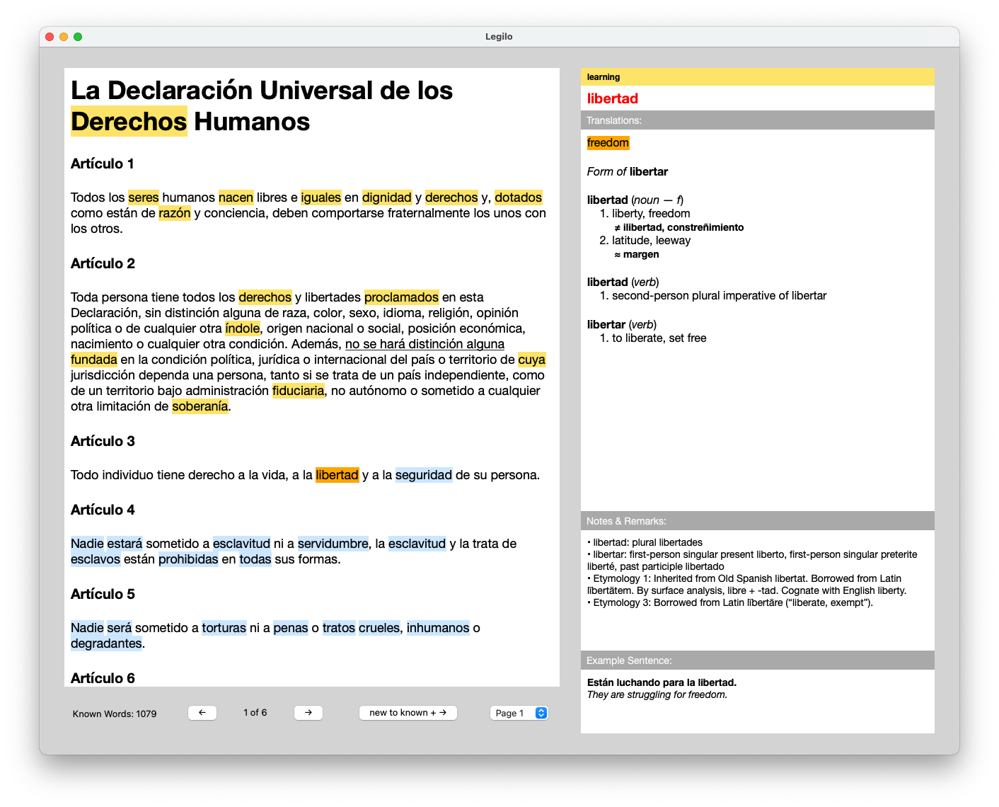

# Legilo
Legilo is a reading tool that facilitates language practicing by allowing you to read any text in the language you are learning and making it easy to identify and look up words and expressions that you don't know yet. The UI is illustrated below:

# How does it work?
The application allows you to import any text you want in your target language. The program labels all words in the text to one of the following categories: new, learning, known or ignored. The new words are marked with a blue background, the learning words are marked with a yellow background, and the known or ignored words are unmarked.

New words are words that haven't been seen previously in any text. Learning words are words that you have seen in some text before, and looked up, but that you don't consider that you know yet. Known words are words that you have skipped without looking up or that you have marked explicitly as known. Ignored words are words that you consider irrelevant, e.g. names, words in another language or numbers. This category is similar to known words, but the words will be stored in a separate list, without translations, and will not be counted into the sum of your known words (that is shown when closing the program).

When reading a text, you iterate through the new and learning words using the keyboard (see below). The current word is marked with an orange background. You can look up a marked word easily or change the label of it using the keyboard as well.

# How to use it?
## Get started
Start by downloading the files, e.g. using `git clone` or clicking the green button "Code" at the top of this page, choosing "Download ZIP" and unzipping the downloaded files. Then navigate to the folder in the terminal (type `cd <path to the folder with the files>`). After that, you type `./run.sh` and press <kbd>⏎</kbd>. This will activate a Python virtual environment (it is created if it doesn't exist already), and make sure that all necessary dependencies are installed in this virtual environment. After that, the program UI will open up in a window.

## General navigation
- <kbd>→</kbd>: Mark the next new or learning word. If the currently marked word is new, and hasn't been looked up, it is marked as known when going to the next word. If it has been looked up, it is saved as a learning word (to prevent this, you can explicitly mark it as known by pressing <kbd>↓</kbd>).
- <kbd>Space</kbd>: Same as <kbd>→</kbd>, but also pronounce the marked word.
- <kbd>⏎</kbd> or <kbd>↑</kbd>:
    - If the dictionary is closed: Look up the marked word in the dictionary.
    - If the dictionary is open: Save the translation for the looked up word and mark it as a learning word.
- <kbd>↓</kbd>: Label the marked word as known.
- <kbd>⌫</kbd>: Label the marked word as ignored.
- <kbd>←</kbd>: Go back to the previous learning word.
- Click on a word to skip to it directly (all new words before it will be automatically labeled as known).
- <kbd>i</kbd>: Insert (or edit) your own translation for a looked-up word. Press <kbd>⏎</kbd> to save it. If the input is empty, the personal translation is removed.
- <kbd>t</kbd>: Add (or remove) a Google translation for a looked-up word.
- <kbd>p</kbd>: Pronounce the maked word.
- <kbd>s</kbd>: Add a translation of a looked-up word, and its translations in English, to your third language (set in `config.json`).
- <kbd>r</kbd>: Edit the remark for a looked-up word. Press <kbd>⏎</kbd> to save.
- <kbd>1</kbd>-<kbd>9</kbd>: Show different example sentences for the looked-up word. Press <kbd>0</kbd> to not show any example sentence at all.
- <kbd>⌘</kbd> + <kbd>↓</kbd> / <kbd>⌘</kbd> + <kbd>↑</kbd>: Scroll the text.
- <kbd>⌘</kbd> + <kbd>→</kbd> / <kbd>⌘</kbd> + <kbd>←</kbd>: Scroll the translation.
- <kbd>⌥</kbd> + <kbd>→</kbd> / <kbd>⌥</kbd> + <kbd>←</kbd>: Scroll the remark.
- Open external resources in a browser:
    - <kbd>d</kbd> Look up the marked word in an external dictionary.
    - <kbd>w</kbd> Open Wiktionary for the marked word.
    - <kbd>c</kbd> Open Context Reverso for the marked word.
    - <kbd>v</kbd> Open a verb conjugation table for the marked word.
    - <kbd>g</kbd> Google the marked word.
    - <kbd>f</kbd> Look up the marked word on Google Images.
    - <kbd>l</kbd> Look up the marked word on Wikipedia.
- <kbd>⌘</kbd> + <kbd>s</kbd>: Save your current progress (collections of words and phrases according to their labels) and the current state (the currently marked word). This is done automatically when closing the window for the application.
- <kbd>⌘</kbd> + <kbd>t</kbd>: Save your current progress (collections of words and phrases according to their labels) as readable text files (the normal saving yields non-readable files).
- <kbd>⌘</kbd> + <kbd>x</kbd>: Close the program without saving your progress.

## Phrase mode
- Hold down <kbd>⌘</kbd> and click the first and the last word in the phrase that you want to look up.
- <kbd>→</kbd>: Close the phrase translation and go back to the currently marked word.
- <kbd>⏎</kbd> or <kbd>↑</kbd>: Save the phrase translation. The phrase will be marked with an underline whenever it occurs in the future.
- Hold down <kbd>⌘</kbd> and click on any word in a previously saved phrase (underlined in the text) to show its translation.
