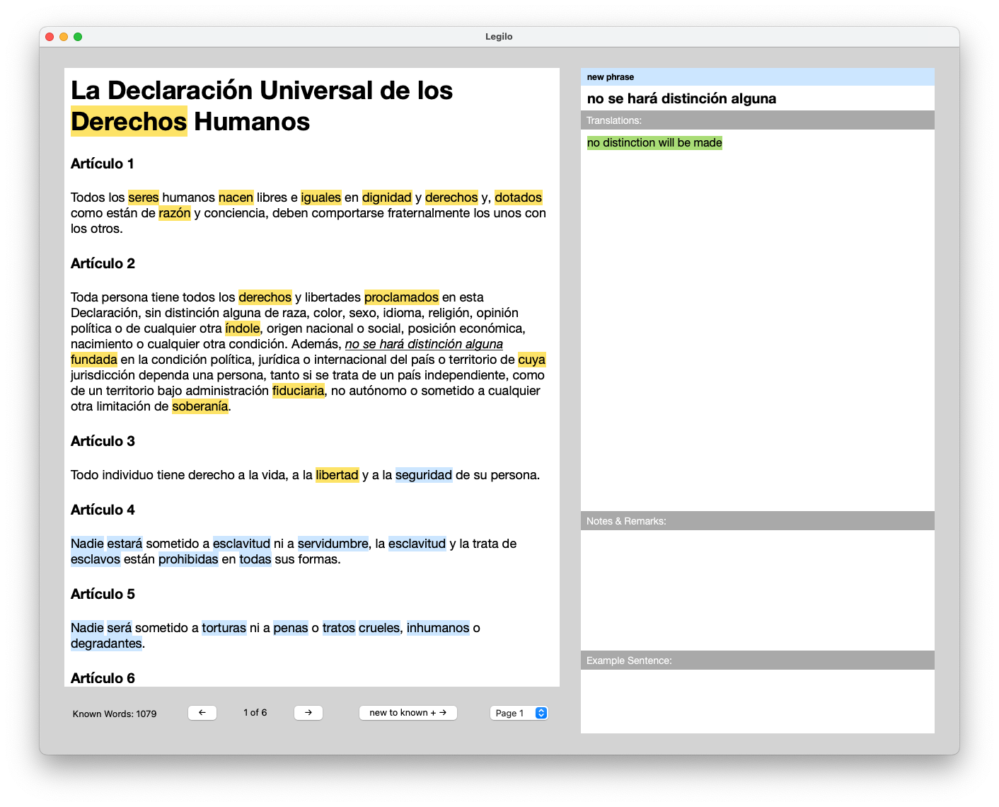

# Legilo

Legilo is a reading tool (in fact, that's the meaning of the name in Esperanto) that facilitates language practicing by allowing you to read any text in the language you are learning and making it easy to identify and look up words and expressions that you don't know yet. The UI is illustrated below:

# How does it work?

The application allows you to import any text you want in your target language. The program labels all words in the text to one of the following categories: new, learning, known or ignored. The new words are marked with a blue background, the learning words are marked with a yellow background, and the known or ignored words are unmarked.

New words are words that haven't been seen previously in any text. Learning words are words that you have seen in some text before, and looked up, but that you don't consider that you know yet. Known words are words that you have skipped without looking up or that you have marked explicitly as known. Ignored words are words that you consider irrelevant, e.g. names, words in another language or numbers. This category is similar to known words, but the words will be stored in a separate list, without translations, and will not be counted into the sum of your known words (that is shown when closing the program).

When reading a text, you iterate through the new and learning words using the keyboard (see below), or words by clicking them. The current word is marked with an orange background. You can look up a marked word easily or change the label of it using the keyboard as well.

**Language support**: I have tested the app with Spanish, German, French, Italian, Russian, Croatian, and Swedish. However, it should also work well for many other languages. Just add the language you want to learn to the `config.json` file (see "Configuration" below) and try it out!

# How to use it?

## Disclaimer

The program has only been tested for macOS, and it is unclear if it will work on other operating systems without further modifications. I made the program for my personal use, with the main focus on getting it to do what it should rather than optimizing the code, and there are no guarantees that it will work well for anyone else. However, you are very welcome to try it out at your own risk.

## Get started

To run the progam, you need a sufficiently new version of Python (it was tested with version 3.11). You can check your Python version by typing `python3 --version` in the terminal and, if necessary, download a new version [here](https://www.python.org/downloads/).

Start by downloading the files, e.g. using `git clone` or clicking the green button "Code" at the top of this page, choosing "Download ZIP" and unzipping the downloaded files. Then navigate to the folder in the terminal (type `cd <path to the folder with the files>`). After that, you type `./run.sh` and press <kbd>⏎ Enter</kbd>. This will activate a Python virtual environment (it is created if it doesn't exist already), and make sure that all necessary dependencies are installed in this virtual environment. After that, the program UI will open up in a window. The first time you run the program for a new language, it can take a while to start. This is due to that it will download some natural language processing models that are used to find the dictionary form (lemma) of words, so that variants of a word can be looked up. You can skip this feature (and thus the downloading of the models) by setting `"use_lemmatizer": false` in `config.json`.

## Language and text selection

Choose language by pressing the indicated key (the letter within `[]`) for each language name. Choose whether you want to add a new text or open a previous text by pressing <kbd>N</kbd> or <kbd>O</kbd>. Press <kbd>⏎ Enter</kbd> to confirm your choices. In this start window, you can also choose to activate dark mode by pressing <kbd>D</kbd> and to deactivate text-to-speech pronunciation by pressing <kbd>P</kbd>. Deactivating pronunciation might make lookup of words faster.

## New text

- Alt. 1 (Manual text insertion): Paste a text in the text field, modify it if you want, and press <kbd>⏎ Enter</kbd> to continue. If you want to add a new line in the text, this can be done by <kbd>⇧ Shift</kbd> + <kbd>⏎ Enter</kbd>.
- Alt. 2 (Automatic text fetching): Paste a URL in the text field and press <kbd>⏎ Enter</kbd>. If the site could be fetched, the text will appear in the text field. Edit it as you want and then press <kbd>⏎ Enter</kbd> to continue.

## Old text

Select one of the listed recent texts by pressing the number before it, or press <kbd>O</kbd> to open another text file. Press <kbd>⏎ Enter</kbd> to confirm your choice.

## Basic navigation

- <kbd>→</kbd> / <kbd>Space</kbd>: Mark the next new or learning word. If the currently marked word is new, and hasn't been looked up, it is marked as known when going to the next word. If it has been looked up, it is saved as a learning word (to prevent this, you can explicitly mark it as known by pressing <kbd>↓</kbd>).
- <kbd>↑</kbd> / <kbd>⏎ Enter</kbd>:
  - If the dictionary is closed: Look up the marked word in the dictionary.
  - If the dictionary is open: Save the translation for the looked up word and mark it as a learning word.
- <kbd>↓</kbd>: Label the marked word as known.
- <kbd>⌫ Backspace</kbd>: Label the marked word as ignored.
- <kbd>←</kbd>: Go back to the previous learning word.
- Click on a word to skip to it directly. All new words before it will be automatically labeled as known.
- <kbd>⇧ Shift</kbd> + <kbd>→</kbd> Mark the next word, regardless of whether it is a known, ignored, new or learning word.
- <kbd>⇧ Shift</kbd> + <kbd>←</kbd> Mark the previous word, regardless of whether it is a known, ignored, new or learning word.
- <kbd>⌘ Command</kbd> + <kbd>→</kbd> Show next page.
- <kbd>⌘ Command</kbd> + <kbd>⏎ Enter</kbd> Mark all new words on current page as known and show next page.
- <kbd>⌘ Command</kbd> + <kbd>←</kbd> Show previous page.
- <kbd>I</kbd>: Insert (or edit) your own translation for a looked-up word. Press <kbd>⏎ Enter</kbd> / <kbd>↑</kbd> to save it. If the input is empty, the personal translation is removed.
- <kbd>U</kbd>: Edit lemmas (associated base forms of the word) and their translations for a looked-up word. An editable text field is enabled where one lemma is listed per line (press <kbd>⇧ Shift</kbd> + <kbd>⏎ Enter</kbd> to make a new line). Each lemma can be associated with a translation by writing `<lemma>: <translation>` in the line of the lemma. If the line doesn't contain a colon, no translation is saved for the corresponding lemma. A suggestion for autocompletion of a line will be shown if available. Press <kbd>⇥ Tab</kbd> to accept the suggestion. Press <kbd>⏎ Enter</kbd> / <kbd>↑</kbd> to save associated lemmas and possible translations.
- <kbd>O</kbd>: Add (or remove) a Google translation for a looked-up word.
- <kbd>P</kbd>: Pronounce the maked word.
- <kbd>H</kbd>: Add a translation of a looked-up word, and its translations in English, to your third language (set in `config.json`) in the remark section. Press the key again to remove it.
- <kbd>R</kbd>: Edit the remark for a looked-up word. Press <kbd>⏎ Enter</kbd> to save. Use <kbd>⇧ Shift</kbd> + <kbd>⏎ Enter</kbd> if you want to make a new line.
- <kbd>1</kbd>-<kbd>9</kbd>: Select and show different example sentences for the looked-up word. Pressing <kbd>9</kbd> will use the current sentence in the text and its Google translation as example sentence. Press <kbd>0</kbd> to not show any example sentence at all.
- <kbd>⌘ Command</kbd> + <kbd>↓</kbd> / <kbd>⌘ Command</kbd> + <kbd>↑</kbd>: Scroll the text.
- <kbd>⇧ Shift</kbd> + <kbd>↓</kbd> / <kbd>⇧ Shift</kbd> + <kbd>↑</kbd>: Scroll the translation.
- <kbd>⌥ Option</kbd> + <kbd>↓</kbd> / <kbd>⌥ Option</kbd> + <kbd>↑</kbd>: Scroll the remark.
- <kbd>A</kbd>: Look up the sentence containing the marked word as a phrase (see "Phrase mode" below).
- <kbd>⌘ Command</kbd> + <kbd>W</kbd>: Save all data and close the text window. You will get back to the start window where you can select another text or close the program by repeating the command. Clicking the close button in the upper corner of the window has the same effect as this command.
- <kbd>⌘ Command</kbd> + <kbd>E</kbd>: Edit the opened text.

## Phrase mode

Phrase mode allows you to look up and save translations for phrases or expressions consisting of several words (see example image below). A saved phrase will show up underlined in any future occurrence, and you can see the translation again by selecting it in phrase mode.

- Press <kbd>E</kbd> to activate or deactivate phrase mode. When phrase mode is active, the word marker will change colors from orange to green.
- Translate a new phrase:
  - Alt. 1 (using the keyboard): In phrase mode, use <kbd>→</kbd> / <kbd>←</kbd> to navigate to the first word in the phrase, and press <kbd>⏎ Enter</kbd> / <kbd>↑</kbd> to select it. Repeat the same procedure to select the second word in the phrase. After this, phrase mode will be deactivated and the phrase will be looked up.
  - Alt. 2 (using the mouse): In phrase mode, click the first and last word in the phrase you want to look up. After this, phrase mode will be deactivated and the phrase will be looked up.
- See translation for a previously saved phrase:
  - Alt. 1 (using the keyboard): In phrase mode, use <kbd>→</kbd> / <kbd>←</kbd> to navigate to any word in the phrase, and press <kbd>⏎ Enter</kbd> / <kbd>↑</kbd> to select it. Phrase mode will be deactivated and the saved translation for the phrase will be shown.
  - Alt. 2 (using the mouse): In phrase mode, click any word in the underlined phrase. Phrase mode will be deactivated and the saved translation for the phrase will be shown.
- <kbd>→</kbd> / <kbd>Space</kbd>: Close the phrase translation and go back to the currently marked word.
- <kbd>↑</kbd> / <kbd>⏎ Enter</kbd>: Save the phrase translation.
- <kbd>↓</kbd>: Remove the phrase from saved phrases.

## External resources

In `config.json`, you can add external resources, such as different dictionaries, verb conjugators or search engines, that open an URL containing the marked word in a browser when pressing a letter key on the keyboard. If the translation for the word is open and contains a lemma form (e.g. the infinitive for a conjugated verb or the singular nominative for a noun form), you can instead look up the lemma form in the same resource by pressing <kbd>⇧ Shift</kbd> + the chosen letter.

As default in the `config.json` file, the following resources are added:

- <kbd>W</kbd> Wiktionary
- <kbd>G</kbd> Google
- <kbd>F</kbd> Google Images
- <kbd>Q</kbd> Wikipedia
- <kbd>L</kbd> Look up in some language-specific dictionary
- <kbd>V</kbd> Some language-specific verb conjugator (for most languages)
- <kbd>C</kbd> Context Reverso (for most languages)

## Advanced commands (mostly used for debugging purposes)

- <kbd>⌘ Command</kbd> + <kbd>S</kbd>: Save your current progress (collections of words and phrases according to their labels) and the current state (the currently marked word). This is done automatically when closing the window for the application.
- <kbd>⌘ Command</kbd> + <kbd>R</kbd>: Save your current progress (collections of words and phrases according to their labels) as readable text files (the normal saving yields non-readable files).
- <kbd>⌘ Command</kbd> + <kbd>X</kbd>: Close the window without saving your progress.

## Configuration

In the file `config.json`, you can set the following things:

- `"languages"`: What languages you want to use the program for.
  - `"<language name>"`: Name of the language.
    - `"external_resources"`: External resources specific to the language in question. Formatted as `"common_external_resources"` (see below).
- `"common_external_resources"`: Settings for exteral resources that are common to all languages.
  - `"url"`: Url for the common resource, where `%s` is used as a place holder for the word or lemma to look up.
  - `"open_key"`: The letter key on the keyboard used to open the external resource.
  - `"phrase_word_delimiter"`: The delimiter used instead of space in the URL of the resource when looking up phrases.
- `"third_language"`: Extra language for which translations can be added to the remark.
- `"use_lemmatizer"` (can have values `true` or `false`): Use natural language processing models to find the dictionary form of a word so that it can be looked up. When this is activated, the program will download the models for a language the first time it is used with that language, which might take a few minutes. It might make the program a few seconds slower to start after that as well, since the models have to be loaded.
- `"font"`: Font to use for all text in the program.
- `"font_size"`: Font size for the main text in the reader. Other text sizes are adapted relative to this.
- `"page_size"`: Maximum number of characters per page. This is applied when creating a new text. The text is then divided into pages with this max size.
- `"short_text_limit"`: Maximum number of characters for a text to be classified as short. If a new text is short, it is not divided into several pages, but imported as one page.
- `"autoscroll"` (can have values `true` or `false`): When going to next or previous word, scroll the page automatically to keep the active word in the center of the upper half of the text field if possible.

## Background and key features

Legilo was inspired by the web and mobile app [LingQ](https://www.lingq.com/) that is based on the same principle of marking new and learning words in texts and facilitating looking up translations for them and phrases in the text. It is a commercial product that has a lot of features that this app doesn't have, such as incorporation of audio files for the text, easy import of material from many sources, built-in content suitable for different language learning levels, as well as the possibility to practice learning words with flashcards etc. However, for me personally, there were some important features that I was missing in LingQ. That's why I decided to implement my own app. These features are described below.

### Key features

#### Simple lookup from Wiktionary

[Wiktionary](https://en.wiktionary.org/) is a great free dictionary that has a lot of content for many languages. It's usually my favorite dictionary to use when learning languages, and I wanted to be able to incorporate the definitions from Wiktionary directly into the lookup section of the app. While it's sometimes sufficient to just get a plain translation of a word from e.g. Google Translate or some similar system, in many cases, I want to get some more information about a word. This might include e.g. several different translations with more nuanced explanations, the gender of a noun, information about what verb conjugation, grammatical number or case the word is, and what base word it is related to.

#### Association with lemmas (base forms of a word)

To connect different forms of a word (e.g. different verb conjugations, different gender variants, plural forms or cases) we want to be able to associate each word with its base form, or lemma. One or several lemmas can be added to a word. After the associations, the translations of the lemmas are included when looking up the variant. If the Wiktionary entry of the word variant refers to the lemma (e.g. by saying "third-person singular present tense of {lemma}"), it is fetched automatically. If that isn't the case, we use a lemmatizer from the natural language processing package [Stanza](https://stanfordnlp.github.io/stanza/) to try to find a lemma. If, despite this, no lemma is found or you want to modify the suggested lemma or add another one, you can easily do that.

#### Showing etymology

Sometimes it's helpful or just fun to look at the etymology of a word. It might increase the understanding of the word by associating it to other words and make it easier to remember. If the Wiktionary article for a word contains an etymology, this is included in the "Notes & Remarks" section of the the lookup column.

#### Example sentences

Sometimes it's useful to see a word used in another example sentence than in the current text to better understand its meaning. To this end, an example sentence with translation for the looked-up word is fetched and shown at the bottom of the lookup column. It can easily be changed to another example sentence by pressing the number keys.

#### Customizable external resources

I want to easily, by just pressing a keyboard key, be able to look up a word in one out of several customizable external resources. These could e.g. be alternative dictionaries, verb conjugators, Google, Wikipedia, or Google Images to get a visual association of the word. Such resources can easily be defined in the `config.json` file. When pressing the associated key, it opens up the lookup result in a new tab in the browser. If using macOS, subsequent lookups are made in the last opened tab, so that you don't have to close the tab before switching back to the app to avoid having many tabs open. Since it in some resources isn't possible to look up specific word variants, but only lemma forms, you can choose to open an external resource for one of the associated lemmas instead, by holding down <kbd>⇧ Shift</kbd> while pressing the associated key.

#### Fully controllable by keyboard

I want to be able to do everything in the app by just using the keyboard, not having to click with a mouse or trackpad. The option of selecting words or sentences by clicking does exist, since it can be easier if you want to select something far away from the currently marked word, but everything in the program can be done with keyboard commands only.

### Alternative similar apps

As previously mentioned, I made this app mainly for myself, and the code quality and reliability is far from what you would expect for a professional product. If you want to use a reading tool that is simple and reliable, and the features listed above aren't essential to you, [LingQ](https://www.lingq.com/) is probably the best option. Another commercial reading tool, that offers a free option, which seems interesting but that I don't have any experience with, is [Readlang](https://readlang.com/). After implementing Legilo, I also found out that there are some other people who were in a similar situation as me and decided to implement their own reading tools and sharing them for free. I haven't tried out any of these myself, but [Lute (version 3)](https://github.com/LuteOrg/lute-v3) seems to be the best option out of these that I have found. A cool feature that distinguishes it from other alternatives is that you can associate a word with an image. Some other similar options include [LWT (improved version)](https://github.com/HugoFara/lwt), [LWT (original version)](https://sourceforge.net/projects/learning-with-texts/), and [FLTR](https://sourceforge.net/projects/foreign-language-text-reader/).
